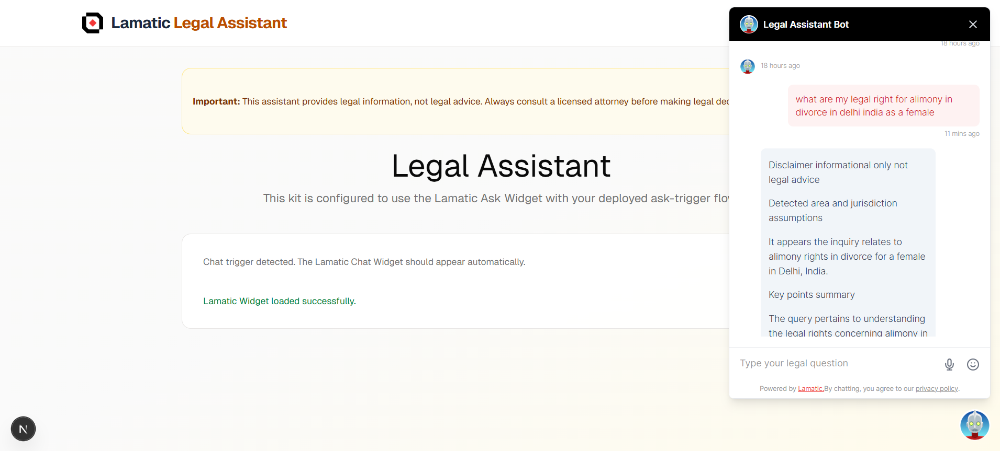

# Agent Kit Legal Assistant by Lamatic.ai

**Agent Kit Legal Assistant** is a Next.js starter kit for a legal assistant chatbot built on Lamatic Flows.

## What This Kit Does and the Problem It Solves

Many users have legal questions but do not know where to begin, which legal area applies, or what next step to take.
This kit provides a structured legal-information assistant that can:
- Classify the likely legal area from a user question.
- Return informational summaries with context-aware references when available.
- Suggest practical next steps and follow-up questions.
- Always show a legal disclaimer so users understand it is not legal advice.

It is designed to:
- Understand user legal questions with optional jurisdiction/context.
- Return an informational legal summary.
- Include references to statutes, case law, or source materials when available.
- Suggest practical next steps.
- Show a clear disclaimer that responses are not legal advice.

## Important Disclaimer

This project is for informational and educational use only.
It is not legal advice, does not create an attorney-client relationship, and should not replace consultation with a licensed attorney.
Do not submit confidential, privileged, or personally identifying information unless you have reviewed and accepted the data retention and logging policies of Lamatic and your configured model provider.

## Prerequisites and Required Providers

- Node.js 20.9+
- npm 9+
- Lamatic account and deployed flow
- Lamatic API key, project ID, and API URL
- LLM provider configured in Lamatic flow (for example OpenRouter/OpenAI, Anthropic, etc.)

## Lamatic Setup (Pre and Post)

Before running this project, build and deploy your legal flow in Lamatic, then wire its values into this kit.

Pre: Build in Lamatic
1. Sign in at https://lamatic.ai
2. Create a project
3. Create a legal assistant flow
4. Deploy the flow
5. Export your flow files (`config.json`, `inputs.json`, `meta.json`, `README.md`)
6. Copy your project API values and flow ID

Post: Wire into this repo
1. Create `.env.local`
2. Add Lamatic credentials and flow ID
3. Install and run locally

## Required Environment Variables

Create `.env.local`:

```bash
ASSISTANT_LEGAL_ADVISOR="your-flow-id-here"
LAMATIC_API_URL="https://your-lamatic-api-url"
LAMATIC_PROJECT_ID="your-project-id"
LAMATIC_API_KEY="your-api-key"
```

## Setup and Run Instructions

```bash
cd kits/assistant/legal
npm install
npm run dev
# Open http://localhost:3000
```

## Live Preview

https://legal-drab-three.vercel.app/

## Execution Paths

- Client widget path: the bundled `flows/assistant-legal-advisor/config.json` uses a Chat Widget trigger and works with `components/legal-ask-widget.tsx`.
- Server orchestration path: `actions/orchestrate.ts#getLegalGuidance` expects an API Request trigger flow. Replace the bundled flow export with an API trigger flow if you want server-side `executeFlow` calls.

## Usage Examples

Try prompts like:
- "My landlord did not return my security deposit in Goa, India. What can I do?"
- "I was terminated without notice. What steps should I consider?"
- "A contractor did not complete agreed work after payment in Singapore. What are my options?"

Expected behavior:
- Assistant returns an informational response with a disclaimer.
- Assistant asks for missing jurisdiction details when needed.
- Assistant suggests practical next steps without claiming to be a lawyer.

## Screenshots or GIFs (Optional)



## Flow Export Location

Place your Lamatic export in:

```text
kits/assistant/legal/flows/assistant-legal-advisor/
```

If you use a chat-trigger flow, update the flow `domains` allowlist to your actual local and production origins before deployment.

Expected files:
- `config.json`
- `inputs.json`
- `meta.json`
- `README.md`

## Repo Structure

```text
/actions
  orchestrate.ts       # Legal assistant flow execution and output mapping
/app
  page.tsx             # Legal assistant UI
/components
  header.tsx           # Top navigation
/lib
  lamatic-client.ts    # Lamatic SDK client
/flows
  assistant-legal-advisor/
/package.json
/config.json
/.env.example
```

## Contributing

Follow the repository contribution guide in [CONTRIBUTING.md](../../../CONTRIBUTING.md).

Please also follow the community [Code of Conduct](../../../CODE_OF_CONDUCT.md).

## License

MIT License. See [LICENSE](../../../LICENSE).
